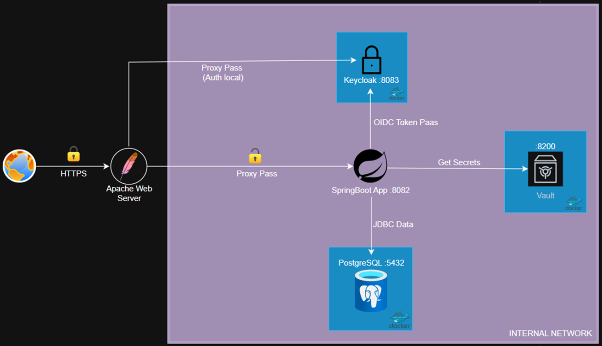

# Secure Room Booking System: A NIST & CIS Hardened Architecture 

## Project Overview

This project is a **Security-First Proof of Concept (PoC)** demonstrating a robust, compliant, and hardened web architecture. While the functional scope is a Room Booking Application, the primary engineering focus was implementing a defense-in-depth strategy compliant with **NIST SP 800-53 Rev. 5** and **CIS Benchmarks**.

The system moves beyond standard development practices by implementing **Secretless Architecture** (via Vault), **Identity Federation** (via Keycloak/OIDC), and rigorous **Network Segmentation**.

---

##  Secure Architecture

The architecture follows a strict "Zero Trust" network model with a single point of entry.

### Network Flow & Segmentation
1.  **Perimeter (Public):** The only exposed service is the **Apache Web Server** (Reverse Proxy) listening on port 443 (HTTPS).
2.  **DMZ/Internal Network:** A private Docker network isolates the backend services.
3.  **Backend Services:**
    * **Spring Boot Application:** Acts as the Policy Enforcement Point (PEP).
    * **Keycloak:** Identity Provider (IdP) & Policy Decision Point (PDP).
    * **HashiCorp Vault:** Centralized Secret Management.
    * **PostgreSQL:** Business data storage (isolated from credentials).

---

##  Security Implementations

### 1. Gateway Hardening (CIS Benchmark) 
The Apache HTTP Server 2.4 acts as the WAF and Reverse Proxy, hardened according to the **CIS Apache Benchmark Level 1 & 2**.
* **TLS Termination:** Enforced TLS 1.2/1.3 with strong ciphers; disabled weak protocols.
* **DoS Protection:** Implemented `mod_reqtimeout` to mitigate Slowloris and body/header exhaustion attacks.
* **Information Leakage:** Suppressed server tokens and signatures (`ServerTokens Prod`, `ServerSignature Off`).
* **Access Control:** Root access denied; strictly limited `AllowOverride` and directory permissions.

### 2. Identity & Access Management (IAM) 
Authentication is decoupled from the application logic using **OpenID Connect (OIDC)** and **OAuth 2.0**.
* **RBAC:** Granular role management (`USER`, `ADMIN`) handled by Keycloak.
* **Token Security:** Aggressive lifespan policies implemented (Access Token: 5 min, Refresh Token: 15 min) to minimize replay attack windows.
* **Brute Force Protection:** Temporary account lockout enabled after 5 failed attempts.
* **Session Management:** Double-submit cookies and `HttpOnly`/`Secure` flags to prevent Session Hijacking.

### 3. Secret Management (Vault) 
Adopted a **"Secretless Application"** paradigm.
* **No Hardcoded Credentials:** Database passwords and Client Secrets are **not** present in `application.properties` or environment variables.
* **Runtime Injection:** Spring Boot authenticates with Vault at startup to fetch ephemeral credentials into memory.
* **Memory Protection:** Vault container configured with `IPC_LOCK` capability to prevent secrets from being swapped to disk.

### 4. GDPR & Data Sovereignty 
Implemented "Right to Erasure" (Right to be Forgotten) through a transactional orchestration:
* **User Orchestration:** A custom Spring Boot flow deletes business data from PostgreSQL and simultaneously invokes Keycloak Admin APIs to remove the identity.
* **Consistancy:** Ensures no "orphaned data" remains in the system.

---

##  Threat Modeling & Compliance

The development lifecycle followed a **Secure SDLC** approach involving automated threat modeling and compliance mapping.

### Threat Modeling (STRIDE with IriusRisk)
We utilized **IriusRisk** to model the architecture, identifying **71 potential threats**.
* **Mitigated by Design:** SQL Injection (via JPA), Auth Bypass (via OIDC).
* **Countermeasures:** Implemented CSRF Protection (Double-Submit Cookie), CSP Headers, and Audit Logging.

### Vulnerability Assessment (OWASP ZAP)
An **Authenticated DAST** (Dynamic Application Security Testing) scan was performed using OWASP ZAP.
* **Result:** 0 High Risk Vulnerabilities.
* **Mitigation:** Medium risks regarding HTTP Headers were resolved by centralizing header management on the Apache Reverse Proxy.

### NIST 800-53 Rev. 5 Compliance Matrix

| Family | Control | Description | Implementation |
| :--- | :--- | :--- | :--- |
| **AC** | AC-3 | Access Enforcement | Role-Based Access Control (RBAC) enforced via Keycloak and Spring Security Filters. |
| **IA** | IA-2 | Identification & Auth | OIDC flow with short-lived JWTs and Brute Force detection. |
| **IA** | IA-5 | Authenticator Mgmt | Password hashing via PBKDF2-SHA256 with 27,500+ iterations. |
| **SC** | SC-8 | Transmission Confidentiality | TLS 1.2+ forced on public gateway; Internal network isolation. |
| **SC** | SC-5 | Denial of Service Protection | Rate limiting and connection throttling on Apache and PostgreSQL. |
| **AU** | AU-2 | Audit Events | Centralized logging of critical actions (Login, Delete Booking) tied to User IDs. |

---

##  Technology Stack

* **Gateway:** Apache HTTPD 2.4 (Hardened)
* **Backend:** Java 17, Spring Boot 3, Spring Security
* **IAM:** Keycloak (OIDC/OAuth2 Provider)
* **Secrets:** HashiCorp Vault
* **Database:** PostgreSQL 14
* **Tools:** Docker, IriusRisk, OWASP ZAP, Postman

